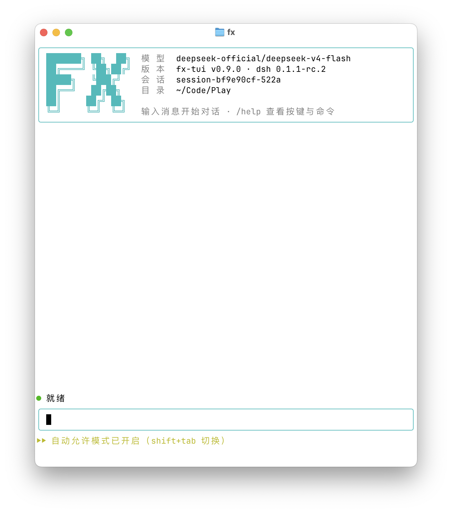

# fx-tui

[DeepSeek Harness](https://github.com/deepseek-ai/deepseek-harness)（dsh）的交互式终端界面 —— 一个树外 bundle 插件，基于 Ink（React）渲染。



## 安装

> **平台说明**：fx-tui 目前**仅在 macOS 上开发和验证**，暂不支持 Windows
> （适配已完成前期调研并暂缓，研究笔记存档于
> [docs/windows-support-notes.md](docs/windows-support-notes.md)，重启适配时以此为准）。
> Windows 用户可先用 dsh 上游自带的 Web UI（`dsh web`）。

把下面这句话复制给任意终端编码 agent（Claude Code、ZCode 等），它会读取安装指南、自动装好并验证：

```text
请读取 https://raw.githubusercontent.com/xianglifei/fx-tui/main/docs/install.md ，严格按其中的步骤帮我把 fx-tui 完整装好并验证可用；任何一步失败就停下，把错误原文完整告诉我，不要自行猜测或跳过。
```

详细步骤与手动安装备查：[docs/install.md](docs/install.md)。

## 使用

```sh
fx                                  # 新会话（等价于 dsh --profile fx）
fx --resume <id>                    # 恢复会话
```

### 按键

| 按键 | 功能 |
|---|---|
| `Enter` | 发送消息 / 确认选择 / 提交自由文本回答 / 执行或补全菜单项 |
| `Ctrl+J` | 输入框内换行 |
| `↑` / `↓` | 翻阅输入历史 / 菜单导航（菜单打开时） |
| `Tab` | 补全菜单高亮项（命令 / 文件路径） |
| `Esc` | 中断当前轮次 / 清空输入 / 跳过问题 / 关闭菜单 |
| `Ctrl+O` | 工具详情 摘要⇄完整 切换 |
| `Ctrl+R` | Transcript 模式（显示注入的上下文） |
| `Ctrl+C` | 清空输入；空输入时再按一次退出 |
| `y` `s` `a` `n` | 审批：一次 / 本会话 / 总是（记住）/ 拒绝 |
| 数字键 | 问题选项选择 |
| `/help` `/status` `/sessions` `/model` `/theme` `/export` `/edit` `/image <路径…>` `/update` `/exit` | 内置命令（`/` 查看全部） |

### 审批记忆

选择 `s`（本会话）或 `a`（总是）后，相同动作的后续审批自动放行：

- bash 命令按**命令原文**记忆（如 `touch ~/x`）
- 文件读写按**路径**记忆，其他工具按完整参数记忆

`a` 的记忆持久化在 `$DSH_HOME/fx-tui-allowlist.json`，删除该文件即清除全部"总是"授权。

## 功能清单

### 对话与渲染

- **启动横幅**：进程启动时在屏幕顶缘渲染 ASCII 品牌盒（box-drawing 边框 +
  FX ASCII logo + 模型/版本/会话/工作目录）。视口空白是**弹性**的：会话不足
  一屏时新消息先消耗空白，横幅钉在顶缘、输入框钉底、零滚动（Claude Code 式）；
  内容超屏后自然滚动、横幅逐行滚入 scrollback。窄终端自动降级（先截断值、再隐藏 logo）
- **滚动式聊天界面**：主屏保留终端 scrollback，历史可搜索、可复制
- **流式 Markdown 渲染**：代码高亮（cli-highlight）、CJK 感知换行（wrap-ansi）
- **多行输入框**：光标编辑、输入历史（↑/↓）、粘贴通道（bracketed paste）、
  CJK 宽度安全、**钉底显示**（Claude Code 式始终位于屏幕最后一行）
- **状态栏**：阶段 spinner + 思考字数 + token 用量 + **上下文水位**
  （`上下文 N%·已用/容量`，token-meter 驱动）+ 窄终端自动降级
- **增量渲染**：Ink `incrementalRendering` 只重绘变更行，降低闪烁
- **双主题自动适配**：启动时经 OSC 11 探测终端背景色，深色终端自动换用为黑
  底调校的 hex 配色（浅色终端保持原有观感）；`/theme`（自动检测 / 浅色 /
  深色，支持中文别名）手动固定并持久化，切换即全量重绘整个转录

### 工具可见性

- **工具调用卡片**（官方呈现层 `presentCall/presentResult`）：命令卡（耗时 + 退出码）、
  文件改动卡（红绿 diff 着色）、搜索卡、读文件卡、web 卡
- **工具详情切换**：`Ctrl+O` 在摘要/完整输出之间切换
- **Transcript 模式**：`Ctrl+R` 显示注入的隐藏上下文（plugin 快照、技能目录等）

### 权限与人机协作

- **审批四选项**：沙箱升级时 `[y] 允许一次 · [s] 本会话不再问 · [a] 总是允许 · [n] 拒绝`
- **审批记忆**：按语义签名（bash 按命令、文件工具按路径）记忆，`a` 持久化到
  `$DSH_HOME/fx-tui-allowlist.json`，同类调用自动放行
- **agent 提问答 UI**：`ask_user_question` 渲染成选项卡（数字键选择）或自由文本问答
- **Plan 审批卡片**：计划模式（`/plan`）下计划 markdown 结构化展示、批准选项 `✓` 标注、
  Enter 直接批准
- **权限模式**：启动默认为「自动允许」（工具调用不再逐个询问）；`/config`（交互
  选择或 `/config permission <auto|ask>`）修改并持久化该默认到
  `$DSH_HOME/fx-tui-settings.json`，删除文件即重置回默认；会话内 Shift+Tab 随时
  切换 `每次询问 ⇄ 自动允许`（仅本会话生效，不写回设置文件），`/status`
  同时展示启动默认与当前会话两个值
- **设置面板**：`/config` 同时管理启动默认权限模式与后台自动更新开关
  （`/config autoupdate on|off`），全部持久化到同一设置文件

### 输入效率

- **Slash 命令补全菜单**：`/` 弹出菜单（内置 + dsh 命令注册表自动并入：
  /compact、/feedback、/goal、/permission…），↑↓ 导航、Tab 补全、Enter 执行
- **@-文件引用**：输入 `@` 弹出工作区文件的 fuzzy 路径补全（零依赖自研评分器），
  选中后模型自动读取该文件
- **$EDITOR 长消息**：`/edit` 挂起 TUI → 打开 `$EDITOR` → 编辑内容回填输入框
- **图片输入**：从 Finder **直接拖图进终端**即自动附加（多选也行），或 `/image <路径…>`
  附加（png/jpeg/webp/gif，经 dsh attachment 服务持久化；路径支持引号/`\ ` 转义/
  `~`/`file://`，可一次多个）；空输入框 `⌫` 撤销最后一张、`⌥⌫` 清空、
  `/image` 空参查看明细、`/image clear` 一键清空；图片随下一条消息发送，
  配视觉路由（如 deepseek-v4-flash-vision-exp）可识图
- **排队输入（steering）**：agent 忙碌时提交显示 `⏳ 已排队`，轮次结束自动消费

### 会话与多任务

- **会话切换**：`/sessions` 弹出选择器**活体切换**（时间/目录/运行中标记）
- **模型切换**：`/model` 选择器热切换（下一步请求生效）并持久化为默认
- **TODO 面板**：`todo_write` 任务列表实时渲染（◐ 进行中 / ☐ 待办 / ☑ 完成）
- **subagent 徽标**：子 agent 运行时状态栏显示 `🌱×N`
- **会话导出**：`/export` 导出为 Markdown 时间线；`fx --resume <id>` 恢复会话
- **运行状态面板**：`/status` 显示版本/模型/会话/上下文/工作区 + 已加载插件树
- **自我升级**：`/update` 在 TUI 内完成「fetch → 快进合并 → 装依赖 → 重建」（适用于
  docs/install.md 的 git 克隆安装）：脏工作区先拦截、列出改动文件（确认可舍弃用
  `/update --force`），只快进不合并不产生本地 merge 提交，断网 / 冲突 / 构建失败均给出
  修复指引；无新提交时直接告结。node_modules 安装形态与非 git 目录自动转为对应的手动升级说明。
  升级落盘后**重启才生效**（运行中的进程仍是旧代码）
- **后台自动更新**：默认开启——启动约两分钟后静默检查并后台重建新版本
  （每 24 小时最多联网一次、跨实例锁互斥、不阻塞不刷屏），成功仅一条
  `✅ 已在后台更新到 vX` 通知，重启 fx 即为新版；`/config autoupdate on|off`
  随时关闭（持久化）

## License

MIT
